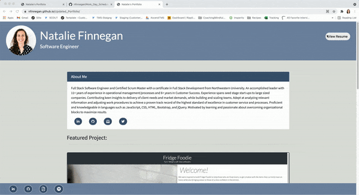

# Updated_Portfolio

## Project Overview

This project was a complete overhaul of version 1 of my original Professional Portfolio. I wanted to incorporate more of the things I've learned in version 2 and look forward to continue to iterate on it.

## Description

Having finished the 8th week of bootcamp, I have a larger breadth and depth of knowledge than I did during week two. My efforts put forth in this version of my Portfolio hopefully display that progress. It currently displays an About Me section, 3 highlighted projects, and links to my resume/github/linkedin/email/twitter/spotify (some displayed in About Me, others in the footer)

## Technologies Used

1. HTML
2. CSS
3. Bootstrap
4. Font Awesome
5. Google Fonts

## Deployed Application

Link to deployed application: https://nfinnegan.github.io/Updated_Portfolio/

## Preview

## License

MIT License

Copyright (c) [2021] [Natalie Finnegan]

Permission is hereby granted, free of charge, to any person obtaining a copy
of this software and associated documentation files (the "Software"), to deal
in the Software without restriction, including without limitation the rights
to use, copy, modify, merge, publish, distribute, sublicense, and/or sell
copies of the Software, and to permit persons to whom the Software is
furnished to do so, subject to the following conditions:

The above copyright notice and this permission notice shall be included in all
copies or substantial portions of the Software.

THE SOFTWARE IS PROVIDED "AS IS", WITHOUT WARRANTY OF ANY KIND, EXPRESS OR
IMPLIED, INCLUDING BUT NOT LIMITED TO THE WARRANTIES OF MERCHANTABILITY,
FITNESS FOR A PARTICULAR PURPOSE AND NONINFRINGEMENT. IN NO EVENT SHALL THE
AUTHORS OR COPYRIGHT HOLDERS BE LIABLE FOR ANY CLAIM, DAMAGES OR OTHER
LIABILITY, WHETHER IN AN ACTION OF CONTRACT, TORT OR OTHERWISE, ARISING FROM,
OUT OF OR IN CONNECTION WITH THE SOFTWARE OR THE USE OR OTHER DEALINGS IN THE
SOFTWARE.
